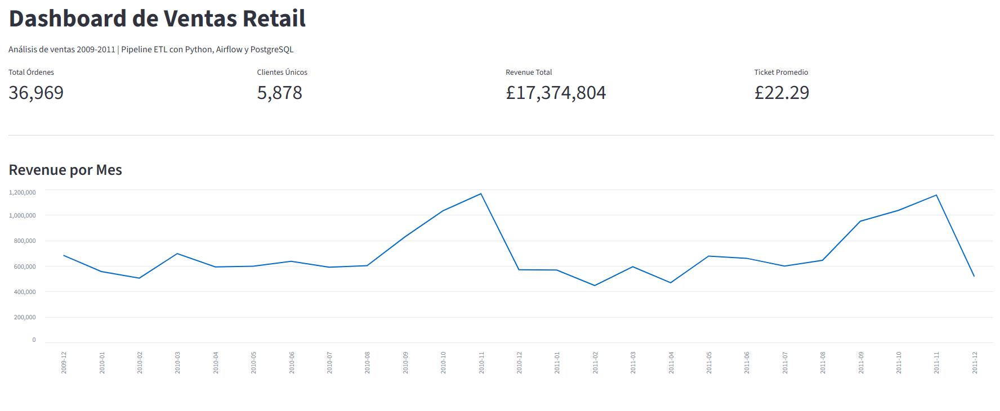
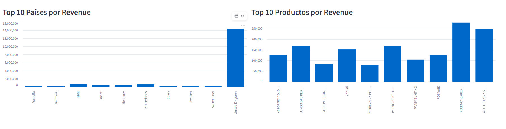

# Retail ETL Pipeline

Pipeline ETL end-to-end sobre un dataset público de ventas retail con más de 1 millón de transacciones, implementado con herramientas usadas en entornos profesionales de datos.

---

## Tecnologías


---

## Descripción

Pipeline de datos completo que procesa el dataset **Online Retail II** (UCI Machine Learning Repository), el cual contiene transacciones reales de una tienda entre 2009 y 2011.

El proyecto cubre todo el ciclo de vida del dato:

- **Extracción** de un archivo Excel con más de 1 millón de filas
- **Transformación** y limpieza de datos (nulos, duplicados, devoluciones)
- **Carga** en un esquema estrella en PostgreSQL
- **Orquestación** automática del pipeline con Apache Airflow
- **Visualización** mediante un dashboard interactivo en Streamlit y reportes en Power BI

## Modelo de Datos

Esquema estrella con las siguientes tablas:

- `fact_sales` — tabla de hechos con 779,000+ transacciones
- `dim_customer` — dimensión de clientes (5,878 clientes únicos)
- `dim_product` — dimensión de productos (4,631 productos únicos)
- `dim_date` — dimensión de tiempo con atributos de año, mes, trimestre

---

## Dashboard






---

## Instalación local

### Requisitos
- Python 3.10+
- Docker Desktop
- Power BI Desktop (opcional)

### Pasos

```bash
# 1. Clonar el repositorio
git clone https://github.com/jesusgm-1/retail-etl-pipeline.git
cd retail-etl-pipeline

# 2. Instalar dependencias
pip install -r requirements.txt

# 3. Levantar PostgreSQL y Airflow con Docker
docker compose up -d

# 4. Crear esquema en la base de datos
Get-Content sql/schema.sql | docker exec -i retail_postgres psql -U retail_user -d retail_db

# 5. Ejecutar el pipeline manualmente
python etl/load.py

# 6. Correr el dashboard
streamlit run dashboard/app.py
```

---
## Dataset

**Online Retail II** — UCI Machine Learning Repository  
Transacciones reales de una tienda UK entre diciembre 2009 y diciembre 2011.  
🔗 https://archive.uci.edu/dataset/502/online+retail+ii
